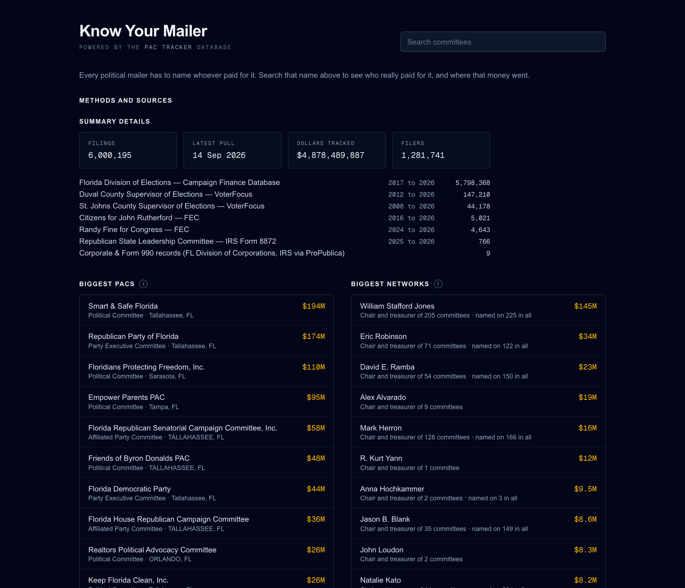
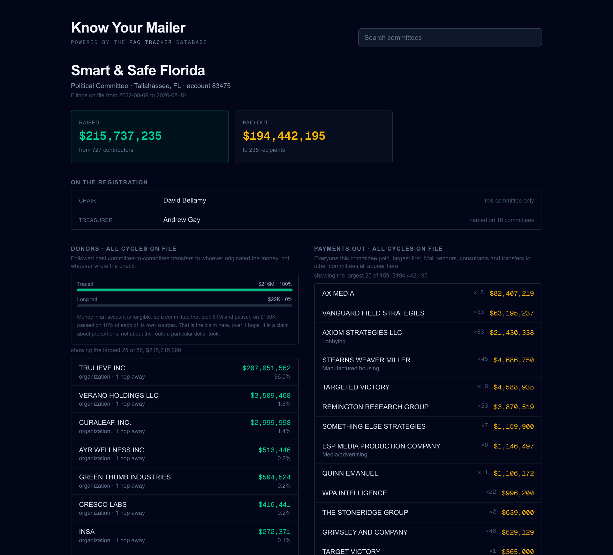
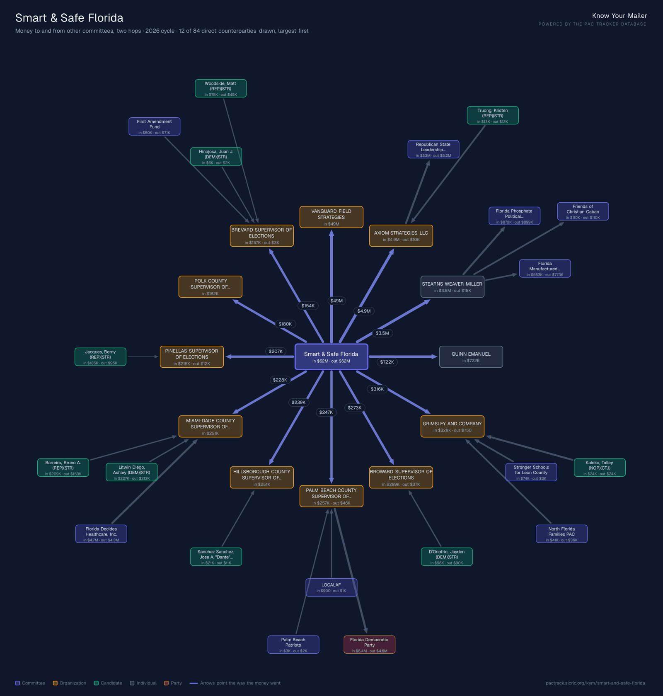
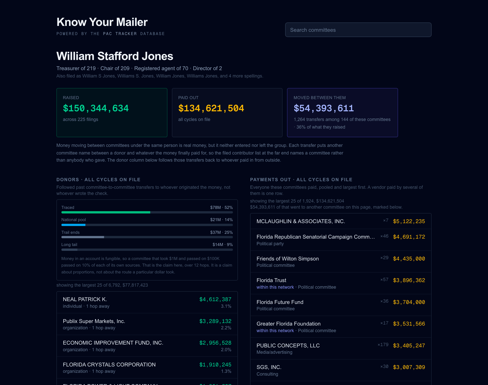

# PAC Tracker

PAC Tracker is a database of Florida campaign finance filings pulled from public data sources.

It holds 6+ million filings and $4.88 billion as of 14 September 2026. The money comes
from the Florida Division of Elections, from county supervisors of elections, from the
IRS and from the FEC.

**Know Your Mailer** is opened to the public. It answers the question about one PAC or one committee officer at a time. The full graphical explorer is for a limited set of users who want to follow more complex connections.

---

## Know Your Mailer

### The problem

A political mailer must name whoever paid for it. That name is almost always a political
committee, which are almost always nothing but dreamed-up names.

Anyone can file a Florida committee. One filing agent in this data is both the chairman and treasurer on 105 open committees. He continually passes money between them. Since he is both chairman and treasurer, it only takes a single signature to do so.

By the time a mailer hits your inbox, the payer listed on the disclaimer says nothing about who funded it. This is the problem the PAC tracker addresses.

### 1. The reader searches the name on the mailer

The search box sits on every page under `/kym`. A reader reads one committee at a time.



The landing page states what the database holds before anyone searches it.

Two lists sit below, and they answer different questions. The left list is the money:
which committees spend the most. The right list is the people: what individuals solely control the most PACs.

### 2. Know Your Mailer shows who funded the committee, and where its money went



The report answers three questions:

- **Who runs this?** The chair and the treasurer, from the state registration. Each name
  carries how many committees that person is named on.
- **Who paid for it?** The donor column. It follows committee-to-committee transfers back
  to whoever originated the money. It only stops at a real person or real organization.
- **What did they spend it on?** The payments column. Mail vendors, consultants and
  transfers to other committees all appear here.

Not all transactions are traced. Federal PACs and nonprofits can legally give money to Florida committees, but their donors are out of scope for this app. The traced amount shows here, as well as the amount from a National pool, any dollars which were more than 12 hops away, and a long tail of many small donations.

### 3. A picture of the nearest two hops



Each report carries a picture of the committees and vendors one and two hops away. The app
draws it server-side and serves it as a PNG from `/api/kym/snapshot/<entityId>`. A reader
can save it or post it without a screenshot tool.

Only direct links are drawn.

### 4. The person behind the committees



A committee's registration gives a chair, a treasurer and a registered agent. Clicking one
opens that person as a subject, over every committee that names them.

This is the thing a single committee page cannot show. The largest network in the live
data raised $150,344,634 across 225 filings. $54,393,611 of that moved between 144 of the
same person's own committees, in 1,264 transfers. That is 36% of what the network raised.

Each transfer puts one more committee name between a donor and whatever the money finally paid for. It is not the same as donated money, so the page reports it separately.

### Public and gated sites

`/kym` is public. So are `/person`, `/methods-and-sources` and the JSON behind them.

Everything else needs a significant amount of RAM and CPU, therefore is behind a login. Accounts are issued manually.

`/api/entities/search` stays behind the gate, because it answers on individual donors with
a home address on file. `/api/kym/search` answers the same question for committees only.

---

## Run Know Your Mailer

Everything runs in Docker Desktop.

### 1. Start the stack

```bash
docker compose up -d --build
```

This starts Postgres, applies the migrations, and serves the app on <http://localhost:3000>.

### 2. Load a cycle

The database starts empty. A whole state cycle is the fastest route to a useful report.
Expect about an hour, unattended:

```bash
docker compose run --rm cli ingest cycle 20261103-GEN
```

Florida files a whole cycle under its general-election id. `20261103-GEN` therefore covers
the 2026 primary too.

### 3. Add the registrations

The chair and treasurer lines come from a different feed. Load it:

```bash
docker compose run --rm cli ingest committees
```

```bash
docker compose run --rm cli ingest committee-details --status=closed
```

The first command gets every active committee. The second gets the closed and revoked
ones, and adds the registered agent.

### 4. Add your counties

The state feed does not hold county filings. Add the counties you care about:

```bash
docker compose run --rm cli ingest county stjohns
```

### 5. Open the site

Go to <http://localhost:3000/kym>.

The reports are cached against the last write to the data. A rebuild empties that cache,
and `ingest rebuild` refills the largest reports before a reader can ask for one.

### Services

| Service | Role |
| --- | --- |
| `db` | Postgres 16. Published on host port **5439**, so host tooling still works. |
| `migrate` | One-shot. Applies migrations and creates `pg_trgm`, then exits. `app` waits on it. |
| `app` | The Next.js server on **3000**. |
| `cli` | The ingest CLI, in the `cli` profile. `up` does not start it. Run it on demand. |

Data lives in the `pactracker-pgdata` volume and survives `docker compose down`. To erase
it, use `docker compose down -v`.

The scraper never runs automatically. It hits a live government service, so it stays an
explicit action.

### Run the app on the host instead

Keep only Postgres in Docker:

```bash
pnpm install && docker compose up -d db
```

```bash
cp .env.example .env && pnpm db:migrate && pnpm dev
```

`.env.example` points at `localhost:5439`. That is the same database the containers use.

### Let people ask for an account

Accounts are issued by hand and there is no self-service sign-up. Someone who reaches the
sign-in page without one has nowhere to go. The page can offer to mail a request instead.

Set the SMTP block in `.env`. See `.env.example`. For IONOS that is `smtp.ionos.com` on
port 587. Set `SMTP_USER` and `SMTP_FROM` to the same real mailbox, because IONOS rejects
a sender it has not authenticated. `ACCESS_REQUEST_TO` is where the requests land, and it
defaults to `SMTP_FROM`.

Leave the block out and the form does not appear. Nothing else depends on it.

This endpoint is the one public thing that makes the server do work. It is capped at three
requests an hour from one address, and forty an hour in total. A failed send still counts.
Each request carries the address, the note, the requester's IP and the `user add` command
that would issue the account.

---

## The graph explorer

The other way in. Pick an entity, choose how many levels to crawl, and the graph builds
outward as the data arrives.

- **Seed on any entity** — committee, candidate, corporation or individual. Picking one
  from search selects it, fills the detail panel, and flies the camera to its tile.
- **Crawl _n_ levels** up, down, or both. Up is who funded them. Down is where the money
  went.
- **Direct and donor links.** *Direct* follows only the committee-to-committee chain,
  which keeps the political money path readable. *Donor* adds the individuals and
  corporations feeding each committee. That is the full funding base, and a far bigger
  graph.
- **Registration links.** A third mode hops on shared officers instead of money. It
  reaches committees with no payment between them at all, then draws the money that *does*
  move inside the network. Dashed violet lines are paperwork, never payments.

  A shared officer is drawn as a **hub node**, not as pairwise edges. Everyone sharing an
  officer shares them with everyone else. The largest network as a clique is 10,308 lines
  and a solid disc. As a hub it is 225 spokes that say the same thing.
- **Progressive rendering.** Each level of the crawl streams over SSE and draws as it
  arrives. The first tiles appear immediately.
- **Zoomable, pannable canvas** with draggable tiles. A tile you move is pinned, and later
  levels arrange themselves around your layout. On-screen **+ / −** and the arrow keys
  drive both, so none of it needs a wheel or a trackpad. Steps are proportional, so one
  press moves the same share of the view at any zoom.
- **Full ledger per entity.** Selecting a tile lists *every* counterparty and *every*
  transaction from the database. It is not limited to the edges the crawl drew. Filter by
  name, sort, page through, and export to CSV.

  The totals reconcile against the tile. A candidate showing "297 sources / $75,819" can
  be accounted for line by line.
- **Funding origins.** A third tab follows the money past the committee-to-committee
  transfers to whoever originated it, pro-rata across every hop. It exports too.

  The export carries a `share_of` column and a `counts_toward_total` flag. The report is
  not a table. A national pool's funders are quoted as shares *of the pool*. For Keep
  Florida Great they sum to $32.2M against a $400K committee.

  Summing the amount column blind is the obvious mistake to make once the numbers leave the
  screen. The file therefore says which rows belong in the total.
- **People are subjects too.** The same report Know Your Mailer shows, inside the panel a
  committee gets.
- **Election cycle filter.** Current, previous, or all. Rollups are stored per cycle, so
  this narrows an index range instead of filtering after the fact. Tile totals, the ledger
  and the funding trace all follow it. A filtered graph never shows one cycle's edges
  under another cycle's numbers.
- **Saved searches** store the seed, the crawl parameters and the tile positions. A
  reopened graph looks the way you left it.
- **PNG snapshot** of the current view.
- **Shareable URLs.** The address bar always reflects the current crawl.

---

## Data sources

### Florida Division of Elections (implemented)

The [campaign finance database](https://dos.elections.myflorida.com/campaign-finance/)
covers **state-level races and every state-registered committee** (PAC, CCE, ECO, ECI,
IXO, PAP, PTY), back to 1996.

One command pulls a whole cycle, because a blank name returns every filer:

```bash
pnpm ingest cycle 20261103-GEN
```

The sweep walks date windows. It halves any window that comes back at the row cap. It
reports the windows it could not fetch completely, instead of returning short in silence.

There is no API. The adapter drives the same CGI endpoints the public search form uses:

| Endpoint | Purpose |
| --- | --- |
| `POST /cgi-bin/contrib.exe` | Contributions. `queryformat=2` returns tab-delimited text. |
| `POST /cgi-bin/expend.exe` | Expenditures. |
| `POST /committees/ComLkupByName.asp` | Committee registry, swept A–Z. |
| `POST /committees/extractComList.asp` | Bulk list of active committees. |
| `GET /committees/ComDetail.asp` | One committee's registration, by account number. |

Contract details that are not obvious, and that cost real time to rediscover:

- A `Referer` from the matching search page is necessary. Without it Cloudflare answers
  `502`.
- `csort1` must not be empty. An empty value makes the CGI emit a bare `ORDER BY`. It then
  returns a SQL Server syntax error **inside an HTTP 200 body**.
- `rowlimit` is `maxlength=5`, but the CGI parses it as a 16-bit signed integer. **32767
  is the real ceiling.** 32768 returns `Overflow Error Number = 6` immediately, before the
  query runs.
- A blank candidate or committee name is *not* an error here. It returns the whole cycle,
  which is what makes a full sweep affordable. The registry lookup behaves differently.
- A result set larger than the row limit is **truncated in silence**. You get exactly
  `rowlimit` rows and no sign that more existed. Split and retry any window that comes back
  at the cap. Never trust one.
- `search_on` is both the mode selector and the "what would you like to know?" choice:
  `1` contributor list, `2` candidate list, `3` candidate totals, `4` committee list,
  `5` committee totals.
- A blank committee-name search returns `500`. Sweep the registry by prefix instead.

The backend is one SQL Server box behind Cloudflare. Requests are therefore serialized and
rate-limited (`FLDOE_REQUEST_DELAY_MS`, default 1500 ms).

### County supervisors of elections — VoterFocus (implemented)

The Division of Elections does **not** hold county filings. County commission, school
board, city commission and special-district races are filed with the 67 county supervisors
of elections. Special districts include mosquito control, airport authorities, ports and
community development districts.

VoterFocus (VR Systems) hosts the portal for a large share of them. **The county is a
single query parameter**, so one adapter covers all of them:

```bash
pnpm ingest counties              # list supported counties
```

```bash
pnpm ingest county stjohns        # sweep the current cycle
```

```bash
pnpm ingest county stjohns --all  # every cycle the portal offers
```

```bash
pnpm ingest county duval --election=33   # one cycle, by portal id
```

Flags are `--key=value`. A space-separated `--election 33` parses as the boolean true, and
would sweep the default cycle instead. The county command therefore rejects it outright.

County portals hold far more history than the state feed exposes. How much, and how it is
carved up, changes by county:

| | St. Johns | Duval |
|---|---|---|
| Cycles offered | 19, back to 2000 | 22, back to 2015 |
| Filings actually begin | 2004 | 2012 |
| Organized by | one entry per cycle | cycle × filer type |
| Full sweep | ~83,000 txns / $25.6M | ~147,000 txns / $110.6M |

A cycle in the dropdown is not evidence that money data exists for it. The candidate index
outlives the financial reports behind it.

Sweeps run oldest-first, so entity resolution meets each recurring donor at its earliest
spelling. One failing cycle does not abort the rest.

A sweep whose election maps to a known cycle also **back-labels rows loaded before that
cycle was recorded**. The row hash excludes the cycle, so those rows match. Without this
they keep a NULL cycle forever. Only a missing cycle is filled. A recorded one is never
overwritten.

**Odd-year municipal elections have no state cycle.** Jacksonville is a consolidated
city-county, so its mayoral, sheriff and council races run in odd years. Those races carry
most of the county's money: 95,844 of Duval's 146,543 rows ($69.6M of $110.6M) sit in the
2015, 2019 and 2023 unitary cycles.

`CYCLES` lists only state general elections. These rows therefore fall back to date
bucketing and merge into the neighbouring even-year cycle. Nothing is lost and the filter
still works. The 2023 Jacksonville mayoral race cannot be selected on its own.

Twenty county slugs are verified. They include Miami-Dade, Broward, Palm Beach,
Hillsborough, Orange and Duval.

This source is richer than the state feed. It gives ISO dates, expenditures inline with
contributions, and an explicit contributor-type code. That code tells resolution when a
donor is itself a committee.

Counties not on VoterFocus, and standalone city clerks, still need their own adapters. See
[`src/lib/ingest/README.md`](src/lib/ingest/README.md).

### IRS Form 8872 — national 527s (implemented, targeted)

Some of the largest money entering Florida races never appears in Florida disclosure. The
Republican State Leadership Committee sent **$3.5M into six Florida committees** across
2025–26, and filed nothing with the state. It is a 527, and it discloses its own funding
to the IRS on Form 8872.

```bash
pnpm ingest irs rslc --from=2025-01-01 --min=10000
```

This is deliberately per-organization, not a bulk import. Such an organization is marked
an **injection point**. A trace stops there and names it, instead of continuing through it.

That is a judgement call, and it is worth stating plainly. The pool's funders are known.
No filing says what share of a nationally raised pool reached Florida.

Attribute its Florida spending pro-rata across its donors and you get estimates that look
exactly like observed transfers. Those estimates rest on an assumption the data cannot
support.

What you get instead is the honest shape: *this $51,429 reached First Coast Leadership
through the RSLC, whose own money is 38% unitemized, 2.3% THE FUND, 2.1% U.S. Chamber of
Commerce, 1.9% Altria…*

### FEC — federal candidates (implemented, targeted)

Federal races are out of scope, but a federal committee that moves money in Florida is
not. Load one by name:

```bash
pnpm ingest fec fine --cycles=2024,2026 --min=200
```

### Corporate and nonprofit profiles (implemented, targeted)

Some of the largest injectors are Florida 501(c)(4) nonprofits rather than committees.
Their donors are undisclosed. The profile feed adds what is public: the Form 990 through
ProPublica, and the corporate record through the Sunbiz quarterly feed.

```bash
pnpm ingest orgs
```

A shared registered agent links such a corporation to a committee.

### The state committee list — who runs each committee (implemented)

Separate from the money, and deliberately so. The Division of Elections publishes a bulk
registration extract at `committees/extractComList.asp`. One POST, no query, 1,984 active
committees. It carries what the transaction exports never do:

```bash
pnpm ingest committees
```

Account number, mailing address, phone, and the chair and treasurer by name.

The bulk list holds active committees only. The per-committee detail page adds the closed
and revoked ones, and it adds the registered agent:

```bash
pnpm ingest committee-details --status=closed
```

Both land in `committee_registrations` and `committee_officers`. Those columns are a
superset of what the two tiers publish, so a county loader has somewhere to put every
field it can read. The state list has no email or website. County pages have no account
number or officer names. Neither dates anything.

Today's load is a snapshot. `effective_date` and `expired_date` stay null and `is_current`
carries the state. A county's officer records *are* dated appointments and resignations,
and they will need somewhere to go.

**Nothing here becomes a graph edge, and it must stay that way.** A shared treasurer is not
a payment. If an affiliation ever reaches `edge_rollups`, the funding trace will walk it.
It would then attribute dollars along "these two committees use the same accountant". That
is the same fabrication the injection-point rule exists to prevent.

**Weight any shared attribute by how many share it.** 65% of active committees share a
treasurer with another committee. That sounds like a finding and is not one. The largest
single treasurer holds 278 committees, and that is a compliance practice.

The distribution is a power law. There are 56 clusters of exactly two, tapering to one
cluster of 228. The small clusters are the signal. One phone number, 352-275-5004, covers
105 committees at four addresses that move $92.7M.

The count therefore appears wherever a name does. The chair and treasurer line under a
committee's name carries `×104`. It greys out once it is large enough to read as a service
provider. Two contrasting cases in the live data:

```
Realtors Political Advocacy Committee     Keep Florida Great
  chair Deborah Rector             3        chair     William S. Jones     104
  treasurer David Garrison         4        treasurer William S. Jones     107
  → four committees, one office             → a Tallahassee filing agent
```

**Misspellings split a person in two, and only a human may merge them.** `officerKey` folds
middle names, initials and punctuation away, so "William Stafford Jones" and "William S.
Jones" key together.

It cannot cross a misspelt name, and the state's list contains several. "Williams S Jones"
and "Wiliam S Jones" keyed apart from the same man. That hid seven committees from a
network of a hundred.

Fuzzy-matching officer names automatically is not the fix. Two people genuinely called
J. Smith are common. A wrong merge asserts that a *named individual* runs committees they
have nothing to do with. Corrections therefore live as enumerated rows in
`officer_aliases`. They apply at ingest and stay reviewable in one place:

```sql
INSERT INTO officer_aliases (alias, canonical, note) VALUES
  ('JONES WILLIAMS', 'JONES WILLIAM', 'Filed as "Williams S Jones"; same person.');
```

**Addresses need normalizing before they group anything.** One operation files under six
spellings of one door in a single extract: "1722 NW 80th Blvd, Suite 90", "1722 Northwest
80th Boulevard", "1722 NW 80th Blvd., Suite 90"…

`normalizeAddress` therefore expands directionals and street types, folds ordinals, and
drops the suite. Dropping the suite groups more and claims less. That is the right trade
only because a shared address is never meant to stand alone.

A unit letter fused to the house number still splits: "2640A" against "2640 A". Joining
them would wreck genuine street names like "100 A Street".

### Others considered

- **Transparency USA** — 25 states, but **state-level only**, and they sell the data
  (CSV/JSON/API by quote). A licensed adapter would drop into the same interface.
- **FollowTheMoney.org** — free API, state-level, but the data stops at 2024 while the
  site merges into OpenSecrets.
- **FEC bulk** — public domain and excellent, but federal only. The targeted adapter above
  covers the cases that touch Florida.

---

## The hard part: entity resolution

Florida's export contains **no entity identifiers**. A recipient is the string
`Florida Chamber of Commerce PAC (PAC)`. A donor is the string `SECURE FLORIDA'S FUTURE`.

Nothing links a committee that *receives* money to the same committee appearing as a
*contributor* elsewhere. Without that link the graph has no edges to traverse past the
first hop.

Two properties of the real data make this harder:

- **Names are truncated at 40 characters.** `Florida Chamber of Commerce Alliance, Inc.`
  arrives as `Florida Chamber of Commerce Alliance, In`.
- **The same organization files under different addresses.** Secure Florida's Future
  appears under both ZIP 32301 and 32302 in the same 2024 cycle.

`src/lib/ingest/resolve.ts` works cheapest-first: in-process cache → exact normalized name
→ known alias → prefix match for truncated strings → trigram shortlist scored with address
signals → create a new entity. Every spelling ever seen is recorded in `entity_aliases`,
so any variant resolves to the same node next time.

The auto-link threshold (0.88) is deliberately high. **A false merge invents money flows
that do not exist.** That is much worse here than leaving two nodes unlinked. Near misses
are stored as low-confidence aliases for review, and are not merged.

In practice that keeps `Florida Chamber of Commerce PAC`, `…CCE`, `…Alliance` and
`Florida Chambers of Commerce ECO` correctly separate. They score 0.70–0.80. It reunites
the truncated Alliance name at 0.95.

### The committee list carries the identifiers the export lacks

The claim above is true of the *transaction* exports. It is false of the committee list,
which gives every active committee an `AcctNum`.

That matters more than it sounds. Loading it exposed **23 committees that name matching
had already merged**:

```
60724 Florida CPA PAC-Central  ┐
60725 Florida CPA PAC-North    ├─ four registrations, one node
60726 Florida CPA PAC          │
60728 Florida CPA PAC-South    ┘
60610/60673/60677  Anesthesiology Leadership Council 3 / 2 / 1
89544/89565        Let Florida Vote II / III
```

What distinguishes these is a numeral or a compass point. That is exactly what
normalization discards, and what a trigram score reads as noise. A shared blocking key
floors the score at 0.80. A ZIP match adds 0.08. The pair then clears 0.88 without
anything having gone obviously wrong.

`ingestCommitteeRegistrations` treats the account number as identity. It claims by
`external_id` first. If name resolution lands on a node another account already holds,
that committee gets its own node instead.

The registrations are therefore correct. **The transactions are not.** They were filed
under names, so the money for all four CPA PACs still sits on one node. Separating it is a
different job. The loader lists every collision it finds, so the work stays visible.

### Traversability is derived, not declared

A node is worth expanding if money flows *into* it. Appearing in the committee registry is
not the test.

Some of the largest conduits in the live data are 501(c)(4) corporations that never
register as committees. Secure Florida's Future sent $2.0M, $1.5M and $1.1M to a single
committee in 2024, and never appeared in the registry. `refreshTraversability()` promotes
any entity that has ever received money.

---

## Architecture

```
src/
  db/schema.ts              entities · aliases · transactions · edge_rollups · saved_searches
                            committee_registrations · committee_officers
  lib/normalize.ts          name normalization, truncation + fuzzy match scoring
                            address/phone/person keys for shared-operative clustering
  lib/ingest/
    fl-doe/{client,parse,adapter}.ts   rate-limited scraper, TSV + registry parsers
    voterfocus/             county portals
    irs-8872/ · fec/ · org-990/ · sunbiz/
    resolve.ts              entity resolution
    pipeline.ts             rows → entities → transactions → rollups
  lib/graph/crawl.ts        BFS crawler, yields one level at a time
  lib/graph/ledger.ts       received/given over a set of committees
  lib/graph/trace.ts        pro-rata funding origins, past the conduits
  lib/graph/officers.ts     a person as a subject: their committees, as one
  lib/kym/                  the public reports: methods, snapshot, namer, cache warming
  app/kym/                  landing · committee report · person report · namer
  app/api/kym/              committee search · server-rendered PNG
  app/api/graph/stream      SSE endpoint
  components/GraphCanvas    Cytoscape canvas
```

`edge_rollups` pre-aggregates entity→entity totals, so expansion is one indexed read per
hop. US Sugar's five separate $250k cheques to the Florida Chamber PAC in 2024 render as a
single $1.25M edge, not five.

---

## Scripts

### Loading

| Command | Description |
| --- | --- |
| `pnpm ingest cycle <electionId>` | Sweep a whole state cycle — every committee and candidate. |
| `pnpm ingest spending-cycle <electionId>` | Sweep a whole cycle's expenditures. |
| `pnpm ingest committees` | Registrations, chairs and treasurers for every active state committee. |
| `pnpm ingest committee-details` | The same for closed committees, plus the registered agent. |
| `pnpm ingest registry` | Sweep the state committee registry A–Z (~7,600 committees). |
| `pnpm ingest counties` | List supported VoterFocus counties. |
| `pnpm ingest county <slug>` | Sweep every candidate and committee in a county. |
| `pnpm ingest irs <org>` | A national 527's funders, from IRS Form 8872. |
| `pnpm ingest fec <candidate>` | A federal candidate's committee. |
| `pnpm ingest orgs` | Refresh nonprofit and corporate profiles (Form 990, Sunbiz). |
| `pnpm ingest committee "<name>"` | Contributions *into* matching committees. |
| `pnpm ingest contributor "<name>"` | Contributions *out of* a contributor. |
| `pnpm ingest candidate "<last>"` | Contributions into a candidate. |
| `pnpm ingest spending "<name>"` | Expenditures *out of* a state committee. Add `--candidate` for a candidate. |
| `pnpm ingest expand <rounds>` | Grow the frontier outward automatically. |

### Maintaining

| Command | Description |
| --- | --- |
| `pnpm ingest rebuild` | Recompute all rollups and totals. It verifies and warms at the end. |
| `pnpm ingest verify` | Confirm no merged-away entity is still present or referenced. |
| `pnpm ingest warm` | Re-run the reports a rebuild emptied, so no reader pays for them. |
| `pnpm ingest purge <source-key>` | Drop everything one source contributed, to re-ingest it cleanly. |
| `pnpm ingest collapse-mirrors` | Drop the payer's copy of a committee-to-committee transfer. |
| `pnpm ingest merge <keepId> <loserId>…` | Fold confirmed duplicates into one entity. |
| `pnpm ingest split <entityId> --city=… --name=…` | Pull two people sharing a name apart. |
| `pnpm ingest set-kind <entityId> <kind>` | Correct a misclassified entity. |
| `pnpm corrections --apply` | Replay the reviewed data fixes in `corrections/corrections.jsonl`. |
| `pnpm dupes` | List candidate duplicate entities for review. |
| `pnpm user add …` | Issue an account. |

`merge`, `split` and `set-kind` all rewrite attribution. Follow each one with
`pnpm ingest rebuild`.

### Reading

| Command | Description |
| --- | --- |
| `pnpm trace "<name>"` | Follow money through conduits to its original sources. |
| `pnpm probe:fldoe` | Live smoke test of the state scraping contract. No database needed. |
| `pnpm probe:voterfocus` | The same for the county portals. |

Common flags: `--election=20241105-GEN`, `--limit=2000`, `--min=1000`, `--frontier=12`.

In Docker, the same commands run as `docker compose run --rm cli ingest <args>`.

### The graph spans tiers by itself

Entity resolution matches on name and deliberately ignores jurisdiction. A committee active
at both levels therefore collapses to a single node.

The Republican Party of Florida's $6,000 to the St. Johns County Republican Executive
Committee links a $13M state committee to a county school board race. Nothing special
handles this. A crawl walks straight through.

---

## Caveats

- Coverage is **Florida, St. Johns County and Duval County**. State-level everywhere, county-level wherever VoterFocus is the
  vendor. Standalone city clerks are not covered.
- Data is only as complete as what you ingested. The crawler cannot show an edge it
  has never fetched.
- **The cycle filter defaults to the current election, not to everything.** With more than
  one cycle loaded, an unfiltered graph answers "who has *ever* funded this". That is
  rarely the question. Switch to *All* deliberately.
- A county sweep is scoped to one election, so its rows carry that cycle explicitly. Rows
  from any source that lack one fall back to the cycle their date lands in. That covers
  IRS 8872 filings and odd-year municipal elections. It is an approximation at the
  boundaries. Excluding them from every filter would make those races vanish from a
  filtered graph, which is worse.
- **State expenditures are loaded for 2024 and 2026 only.** Earlier cycles have none. A
  committee active before 2023 therefore shows money arriving and never leaving. Sweep
  another cycle with `pnpm ingest spending-cycle <electionId> --from=… --to=…`.
- **Committee-to-committee transfers are stored once, from the recipient's filing.** Both
  parties report the same money. The payer reports an expenditure and the recipient
  reports a contribution. The ingest drops the payer's copy.

  A committee's expenditure ledger is therefore its *vendor* spending. Its transfers to
  other committees appear as contributions on the receiving side. Self-loops are exempt,
  because a candidate reimbursing their own campaign genuinely files both halves.
- **Generic local-office names are scoped to the county that filed them.** Every county has
  a "Republican Executive Committee" and a "Supervisor of Elections", and counties file
  under exactly those bare names. Left alone they collapse into one node, or onto whichever
  county does spell itself out.

  `isGenericLocalOffice` detects a name that gives an office but no place. Such names
  resolve within their county rather than statewide. Names that do say which county are
  untouched. "St. Johns County Republican Executive Committee" stays a single node across
  levels, which is what lets a committee giving at both levels remain one entity.
- **Duval is not yet fixed.** Its bare "Republican Executive Committee" rows still sit on
  the Gadsden node — $5.7M in and $6.5M out, against $5,000 that is genuinely Gadsden's.
  Unlike St. Johns, Duval *does* have a state registry entry to map onto.
- Below-threshold aliases are stored for review and must never be read back as answers.
  Doing so is what merged three counties' committees. "Republican Executive Committee"
  scored 0.809 against Gadsden's, under the 0.88 needed to link. It was filed as a
  suggestion, then consumed as the answer on every later lookup. Alias lookup now requires
  `AUTO_LINK_THRESHOLD`.
- Re-sweeping an already-loaded cycle can leave orphan nodes. Resolution creates an entity
  before the insert is attempted, and a row that deduplicates on its hash leaves that entity
  with nothing attached.

  They are harmless in the graph, because they have no edges. They do show up in search as
  zero-dollar results. Delete county-sourced entities with no transactions after a
  re-sweep. The ~4,500 state-sourced orphans are different and must be kept. They are the
  committee registry, which is what resolution matches against.
- A cycle sweep reports any window it could not fetch completely, instead of returning
  short in silence. Quarter-end filing dates are where this bites. They can exceed the
  service's row cap within a single day. Recover them by subdividing on contributor name
  and amount.
- **Truncation is measured in lines delivered, not rows parsed.** The exports drop a
  variable number of lines to malformed content — 3 in one response, 273 in another. A
  reply cut off at exactly the 32,767-row cap can therefore yield far fewer usable rows. It
  then looks like a short, and therefore final, window. A sweep that makes this mistake
  stops early and reports success.

  This cost real data before it was fixed. The 2026 contribution cycle missed 28,839 rows
  and reported complete. That is a third of the final month, and all of the most recent
  day. The 2024 cycle, checked the same way, was intact across all 1.49M rows.

  Trust a sweep's own summary only as far as a re-fetch confirms it. Compare row hashes
  from the live feed against the database. Expect deliberate absences from the mirror guard
  and the cycle-end cutoff.
- **An audit against a live source measures elapsed time as well as loss.** Re-fetching the
  counties and diffing row hashes reported 1,915 rows the database did not have. That
  looked like an ingestion fault. Party executive committees in both counties stopped dead
  on 2026-03-31, the same date, independently.

  They had not. The morning sweep took every row the portal held: 250 of 250 on one
  committee, 148 of 148 on another. The committees filed their April-onward reports that
  afternoon, against a shared deadline, and the audit ran after. Re-sweeping recovered
  1,914 rows. The audit's arithmetic was right to within one row. Its framing was not.

  For counties, whose filings arrive in periodic batches, sweep and audit must bracket the
  same moment. Otherwise the diff is mostly a clock. The state feed does not have this
  problem in the same way. A third of a month that vanishes at a hard cutoff is not filing
  lag.
- Postgres runs with `shm_size: 1gb`. Docker's 64 MB default is too small for the parallel
  plans the trace queries produce. The failure is opaque: "could not resize shared memory
  segment … No space left on device" (SQLSTATE 53100). That reads like a full disk rather
  than a container limit.
- Entity resolution is good, not perfect. `FLORIDA CHAMBER PAC` and `Florida Chamber of
  Commerce PAC` are almost certainly the same organization. They score 0.767 and remain
  separate, pending review.
- **The canvas is a filtered slice. The panel is the whole record.** A crawl applies a link
  mode, a per-node cap and a node ceiling, so the graph deliberately shows a subset. Use
  the detail panel's ledger when you need completeness. It queries the database directly
  and ignores the crawl.
- A candidate who funds their own campaign resolves onto their own node, which produces a
  self-loop. Those are shown and labelled `self`. They are excluded from
  committee-to-committee "direct" links, because self-funding is not a link between two
  organizations.
- Amounts are as reported. In-kind contributions are included and flagged. They are not
  netted out.

---

## Licence

MIT. The underlying campaign finance records are Florida public records.
